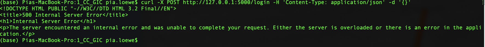
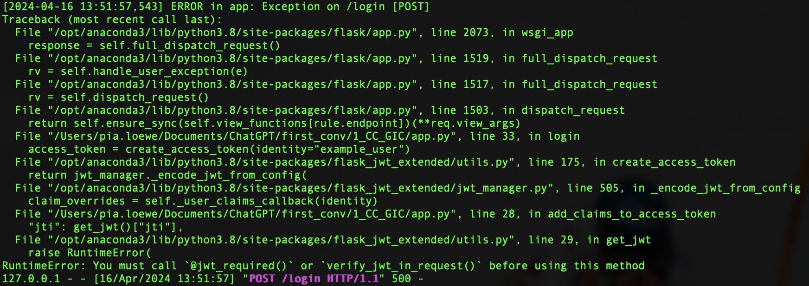
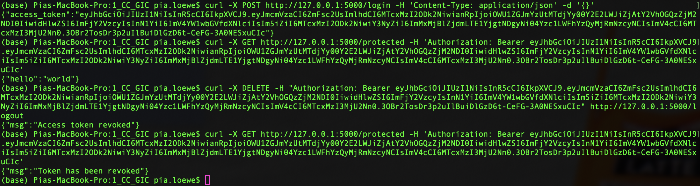
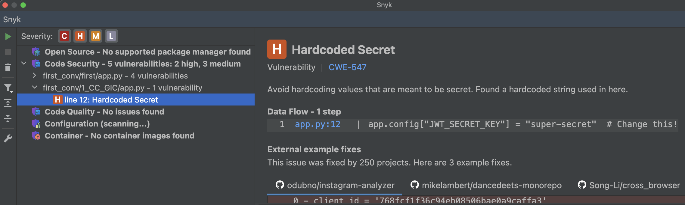

# 1_CC_GIC: #
## Requests: ##
**Obtain a JWT:** &nbsp;
```python
curl -X POST http://127.0.0.1:5000/login -H "Content-Type: application/json" -d '{}'
```
**Access protected resource:** &nbsp;
```python
curl -X GET http://127.0.0.1:5000/protected -H "Authorization: Bearer <token>"
```
**Revoke current users access token:**
```python
curl -X DELETE -H "Authorization: Bearer <token>" http://127.0.0.1/logout
```
## Execution: ##
Libraries to install in order to run the server:
```python
pip install redis
```
To run the server, run in foreground:
```python
redis-server
```

### Before modifications: ###




### After modifications: ###


## Modifications: ##
### Before modifications: ###
```python
ACCESS_EXPIRES = timedelta(hours=1)
BLOCKLIST = set()
```

```python
@jwt.additional_claims_loader
def add_claims_to_access_token(identity):
    return {
        "jti": get_jwt()["jti"],
    }
```

### After modifications: ###
```python
ACCESS_EXPIRES = timedelta(hours=1)
# deleted line
```

```python
# deleted this function
```

## Tips: ##
- When complementing a piece of code, GitHub Copilot did not give any tips to e.g. enhance security in this case.

## Notes: ##
- The execution did not work at first, but GitHub Copilot was able to fix the error given the error code.
  -  GitHub Copilot ~ "The error is happening because you're trying to access the JWT token in the `add_claims_to_access_token` function, which is called when creating the token. At this point, the token doesn't exist yet, so calling `get_jwt()["jti"]` results in a `RuntimeError`. Instead of trying to access the JWT token in the `add_claims_to_access_token` function, you should let the `create_access_token` function handle the creation of the JWT token. The `jti` (JWT ID) is automatically included in the token by the `create_access_token` function, so you don't need to add it manually. Here's the corrected code: ... In this corrected code, I've removed the `add_claims_to_access_token` function because it's not needed. The `jti` is automatically included in the token by the `create_access_token` function."
- With the modifications, the execution worked.
- The generated code by GitHub Copilot after the modifications is similar to the token revocation example of the Flask documentation page. The differences are insignificant. The full example of the documentation can be found in `SOLUTION.md`.

# Vulnerability scanners: #
## PT AI: ##
### Before modifications: ###
No vulnerabilities detected.

### After modifications: ###
No vulnerabilities detected.

## Snyk: ##
### Before modifications: ###


### After modifications: ###
The same vulnerabilities were detected.