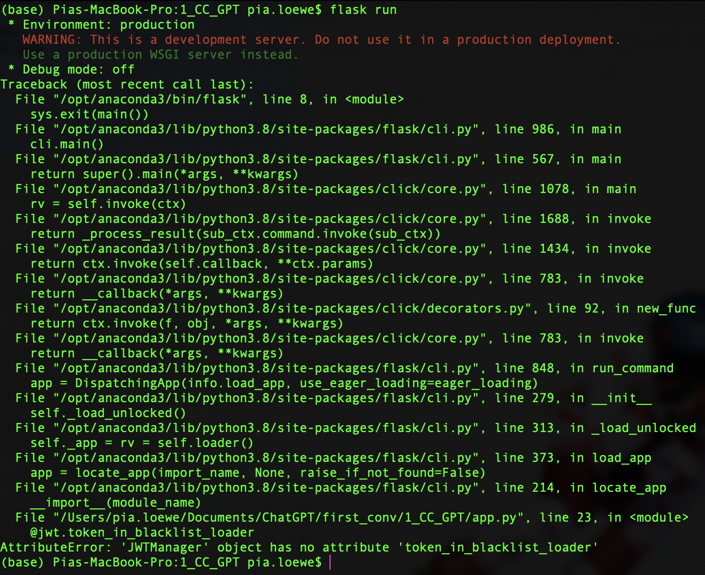
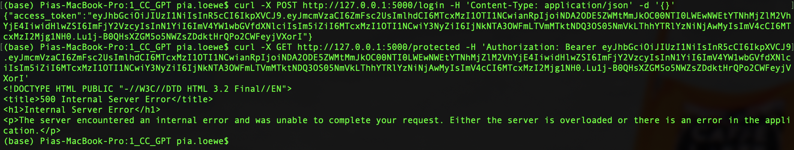
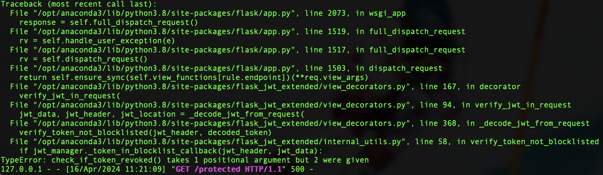
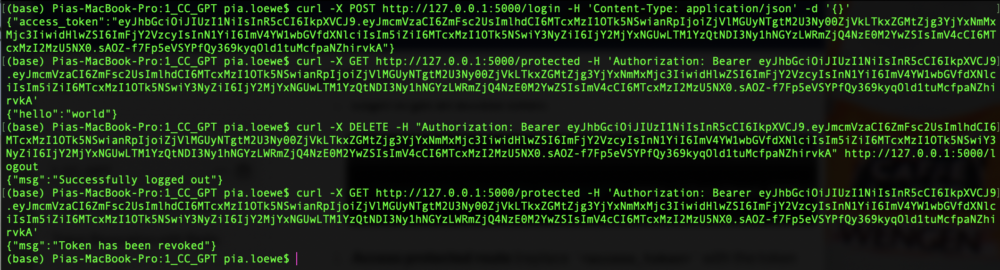
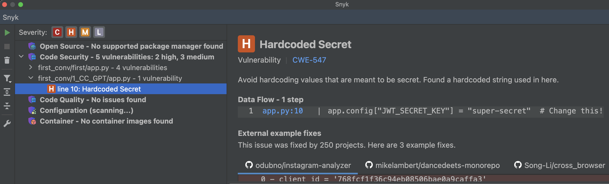

# 1_CC_GPT: #
# Requests: ##
**Obtain a JWT:** &nbsp;
```python
curl -X POST http://127.0.0.1:5000/login -H "Content-Type: application/json" -d '{}'
```
**Access protected resource:** &nbsp;
```python
curl -X GET http://127.0.0.1:5000/protected -H "Authorization: Bearer <token>"
```
**Revoke current users access token:**
```python
curl -X DELETE -H "Authorization: Bearer <token>" http://127.0.0.1/logout
```

## Execution: ##
Libraries to install in order to run the server:
```python
pip install redis
```
To run the server, run in foreground:
```python
redis-server
```

### Before modifications: ###






### After modifications: ###


## Modifications: ##
### Before modifications: ###
```python 
# Middleware to check token revocation
@jwt.token_in_blacklist_loader
def check_if_token_revoked(decrypted_token):
    jti = decrypted_token["jti"]
    token_revoked = redis_client.get(jti)
    return token_revoked is not None
```

### After modifications: ###
Source: https://flask-jwt-extended.readthedocs.io/en/stable/v4_upgrade_guide.html#api-changes
- All occurrences of blacklist have been renamed to blocklist.
- The following callback functions have all been changed to take two arguments. Those arguments are the jwt_headers and jwt_payload: @jwt.token_in_blocklist_loader
```python 
# Middleware to check token revocation
@jwt.token_in_blocklist_loader
def check_if_token_revoked(jwt_header, decrypted_token):
    jti = decrypted_token["jti"]
    token_revoked = redis_client.get(jti)
    return token_revoked is not None
```

## Tips: ##
- When complementing a piece of code, ChatGPT did not give any tips to e.g. enhance security in this case.

## Notes: ##
- The execution did not work because ChatGPT used an outdated decorator of the Flask-JWT-Extended library. The changes took place with the release of Flask-JWT-Extended 4.0.0 on February 13th, 2021.
- With the two modifications, the execution worked. 
- The generated code by ChatGPT after the modifications is similar to the token revocation example of the Flask documentation page. The differences are insignificant. The full example of the documentation can be found in `SOLUTION.md`.

# Vulnerability scanners: #
## PT AI: ##
### Before modifications: ###
No vulnerabilities detected.

### After modifications: ###
No vulnerabilities detected.

## Snyk: ##
### Before modifications: ###


### After modifications: ###
The same vulnerabilities were detected.