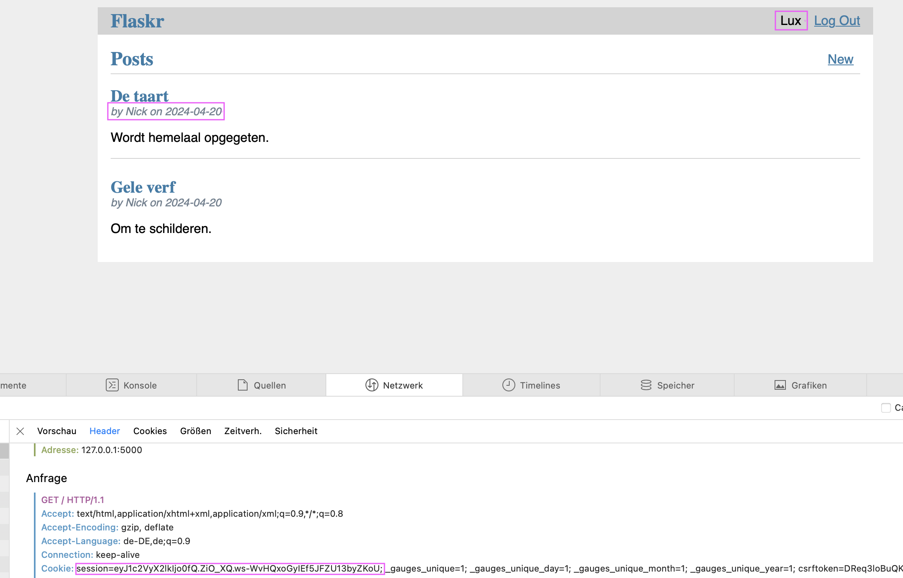
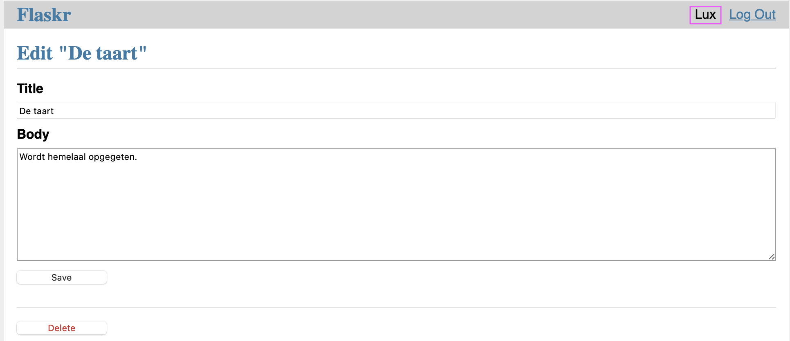
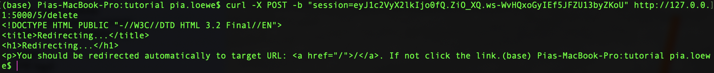
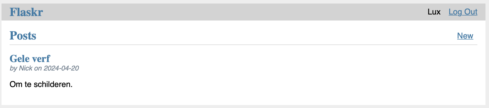
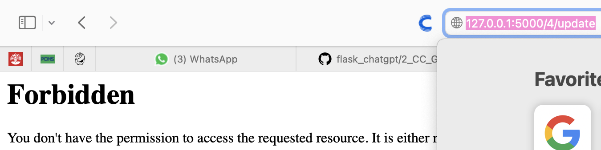
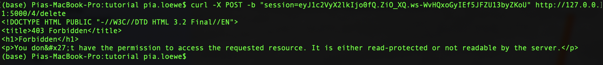
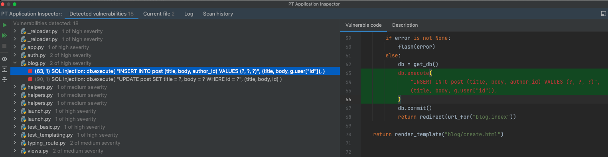
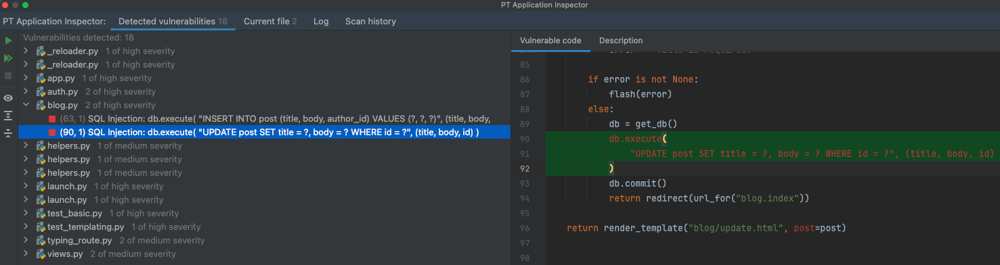
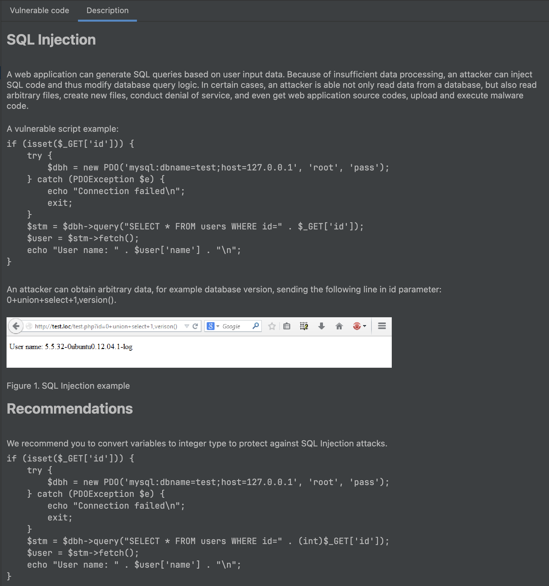
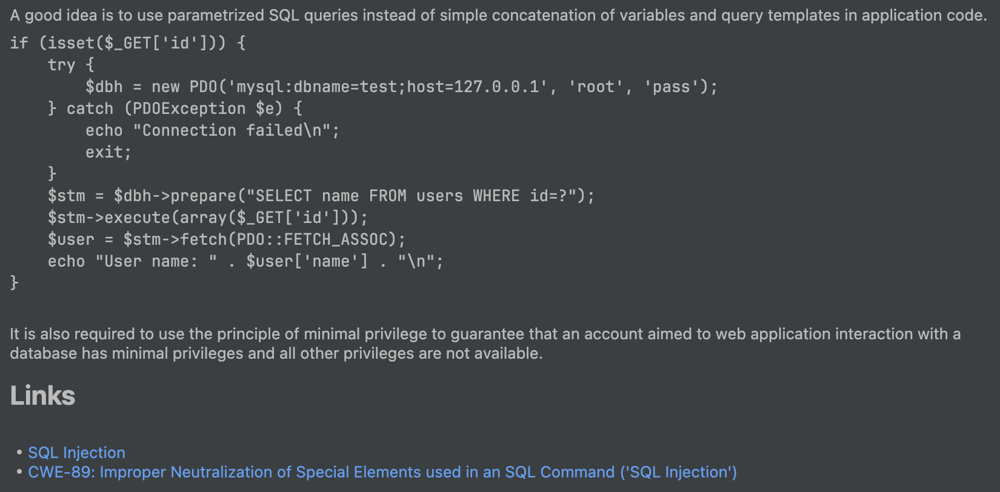

# 1_EC_GIC: #
## Execution: ##
The images from `1_EC_GPT` were used.
### Before prompting GitHub Copilot: ###
User 'Lux' is able to see posts from user 'Nick'. Lux can see his own `session` cookie.

Error: Lux can update Nick's post, calling `http://127.0.0.1:5000/5/update`.

Error: Lux can delete Nick's post using his own `session` cookie.

### After prompting GitHub Copilot: ###
Lux cannot update Nick's post.

Lux cannot delete Nick's post.

## Notes: ##
- The execution worked functionally correct after GitHub Copilot's error fix.
- GitHub Copilot's solution was identical to the one from the Flask documentation. The solution from the Flask documentation can be found in `SOLUTION.md`.

# Vulnerability scanners: #
## PT AI: ##
### After prompting GitHub Copilot: ###
2 high in the code generated by GitHub Copilot:
1.

2.

## Snyk: ##
### After prompting GitHub Copilot: ###
No vulnerabilities were detected in the code generated by GitHub Copilot.