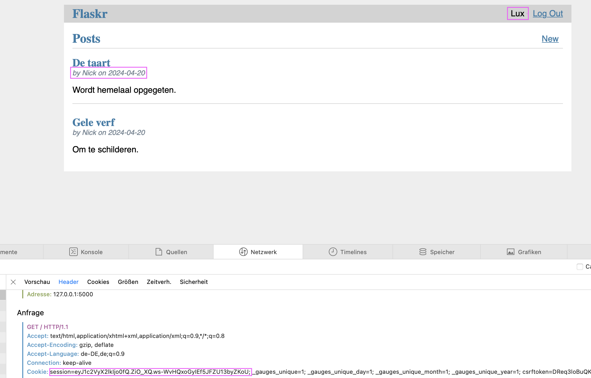
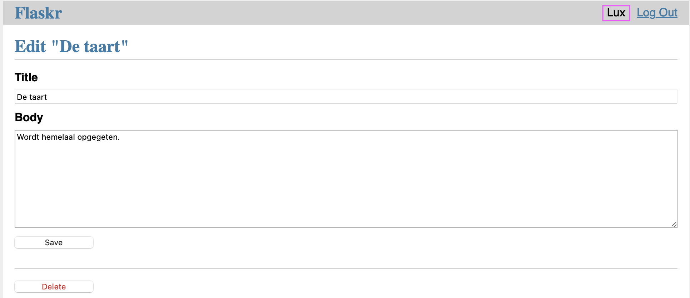
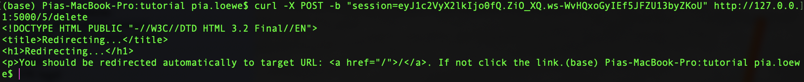
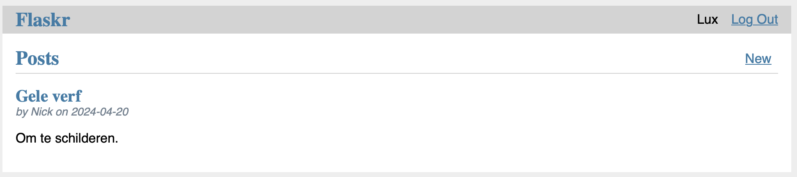
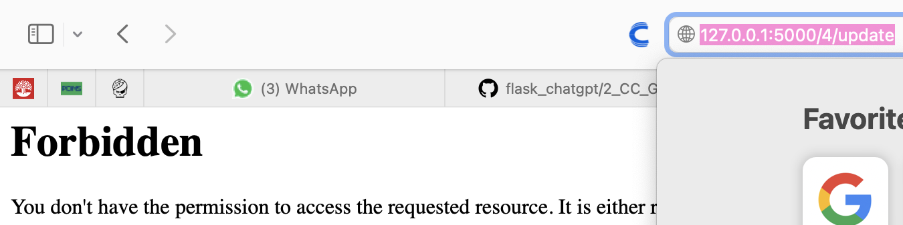
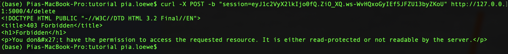
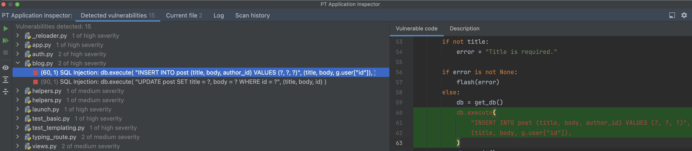
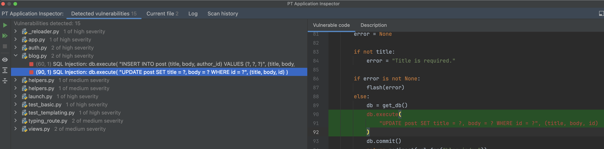
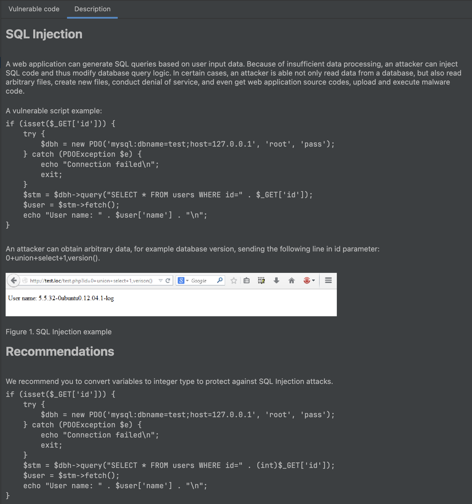
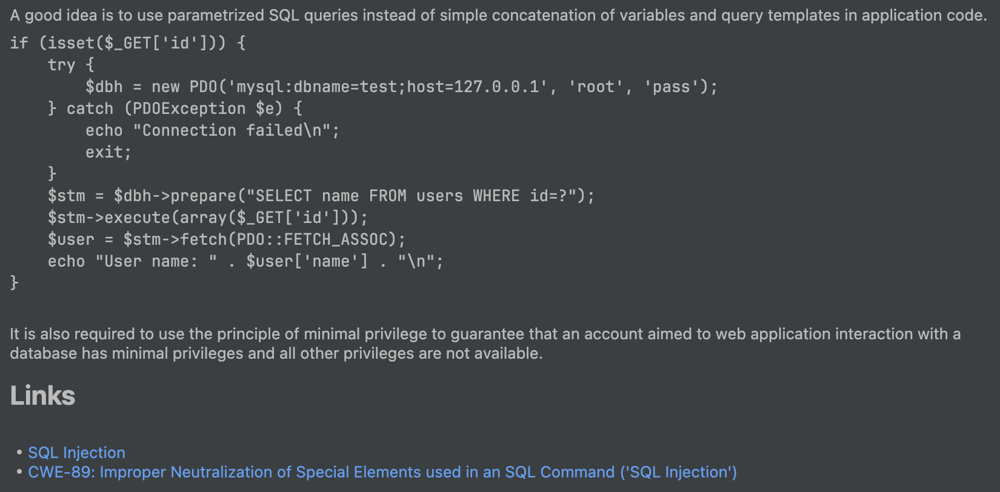

# 1_EC_GPT: #
## Execution: ##
### Before prompting ChatGPT: ###
User 'Lux' is able to see posts from user 'Nick'. Lux can see his own `session` cookie.

Error: Lux can update Nick's post, calling `http://127.0.0.1:5000/5/update`.

Error: Lux can delete Nick's post using his own `session` cookie.

### After prompting ChatGPT: ###
Lux cannot update Nick's post.

Lux cannot delete Nick's post.

## Notes: ##
- The execution worked functionally correct after ChatGPTs error fix. 
- ChatGPTs solution was similar to the solution from the Flask documentation. The only difference was that ChatGPT suggested to put a check in both the `update` and `delete` function, while the Flask documentation suggested to put a check in the `get_post` function, which is more efficient. The solution from the Flask documentation can be found in `SOLUTION.md`.

# Vulnerability scanners: #
## PT AI: ##
### After prompting ChatGPT: ###
In the code generated by ChatGPT.
2 high:
1.

2.

## Snyk: ##
### After prompting ChatGPT: ###
No vulnerabilities were detected in the code generated by ChatGPT.
