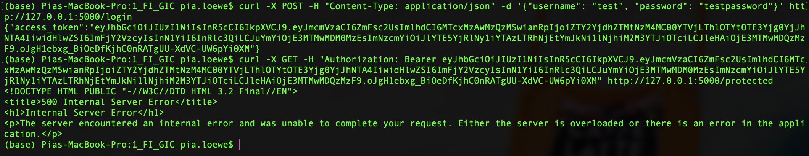
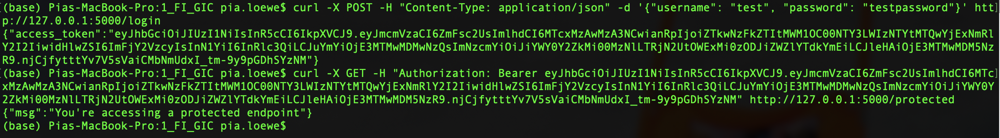
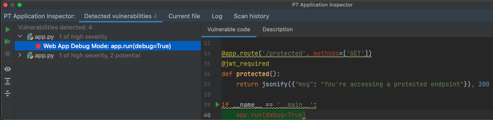
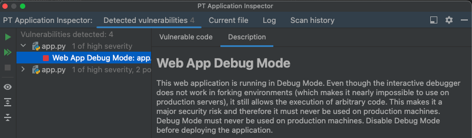
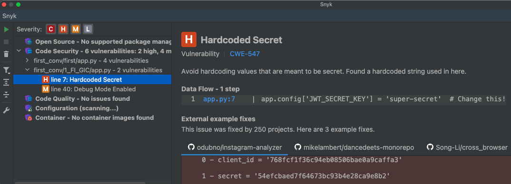
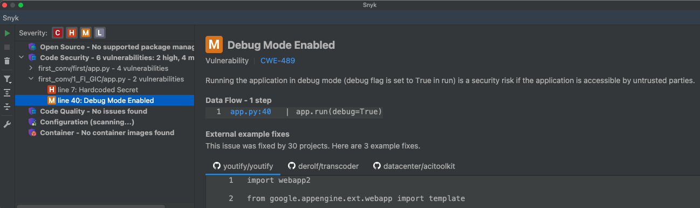

# 1_FI_GIC #
## Libraries: ##
No information was given on which libraries to install.

## Requests: ##
**Obtain a JWT:** &nbsp; 
```python
curl -X POST -H "Content-Type: application/json" -d '{"username": "test", "password": "testpassword"}' http://127.0.0.1:5000/login
```

**Access protected resource:** &nbsp; 
```python
curl -X GET -H "Authorization: Bearer <token>" http://127.0.0.1:5000/protected
```

## Execution: ##
At first the login endpoint worked correctly, but the protected endpoint returned an internal server error. 

### Before modifications: ###


### After modifications: ###


## Modifications: ##
### Before modifications: ###
```python
@app.route('/protected', methods=['GET'])
@jwt_required
def protected():
    return jsonify({"msg": "You're accessing a protected endpoint"}), 200
```

### After modifications: ###
```python
@app.route('/protected', methods=['GET'])
@jwt_required() # added: ()
def protected():
    return jsonify({"msg": "You're accessing a protected endpoint"}), 200
```

## Tips: ##
- In-code-comment (line 7): "Change this!"
- Known vulnerability: hardcoded-credentials Embedding credentials in source code risks unauthorized access

## Notes: ##
- No libraries to be installed were given.
- The execution did not work correctly, because of a small error in the code.
- After the small modification, the execution worked correctly.
- :) Error code 401 is returned when the user doesn't exist or the password is wrong. Regarding security, this is a good response for this scenario.
- Different to ChatGPTs response, the response distinguishes between missing username and missing password.

# Vulnerability scanners: #
## PT AI: ##
### Before modifications: ###
1 of high severity:



### After modifications: ###
The same vulnerabilities were detected.

## Snyk: ##
### Before modifications: ###
1 high severity:


1 medium severity:


### After modifications: ###
The same vulnerabilities were detected.

