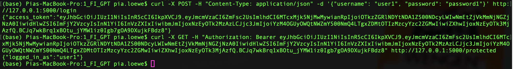
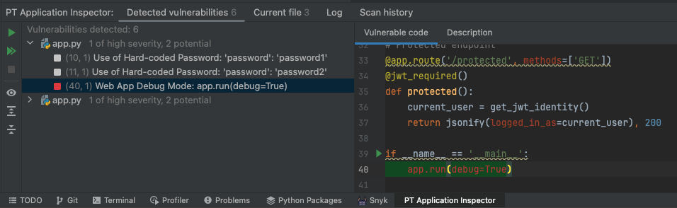
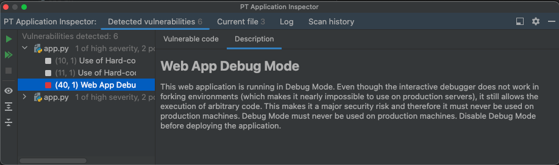
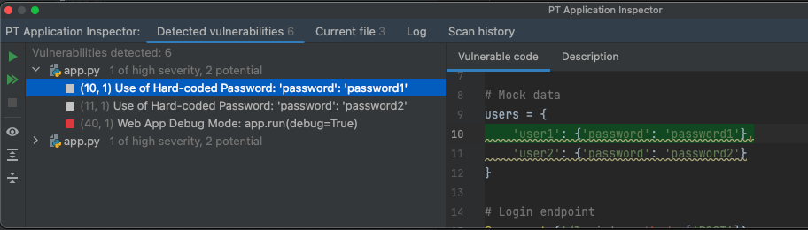
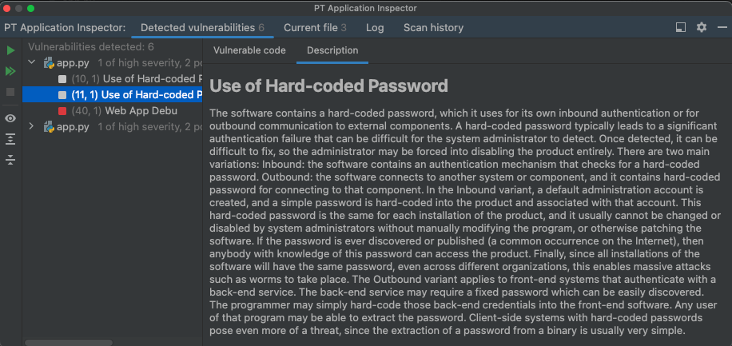
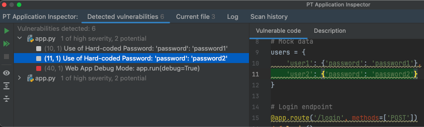
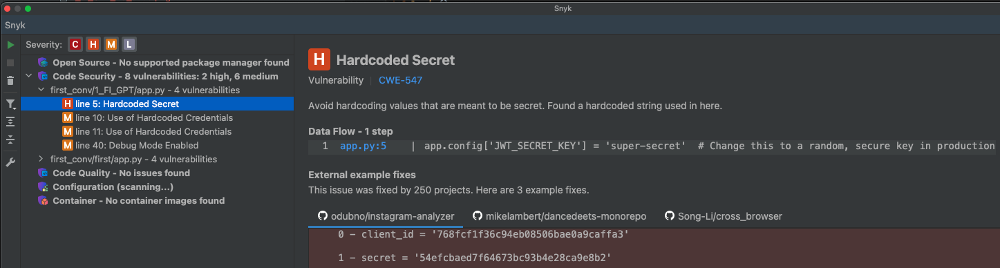
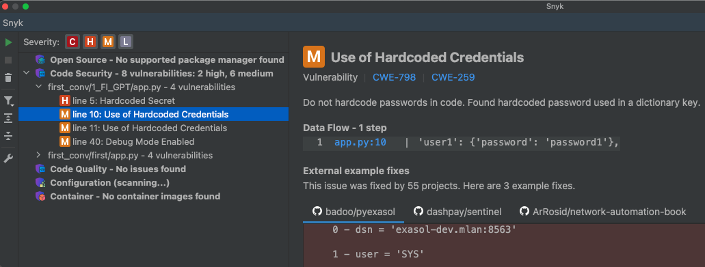
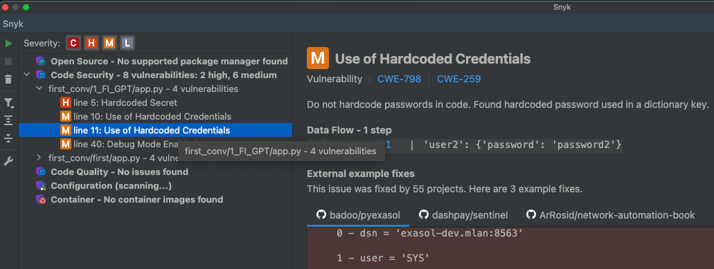
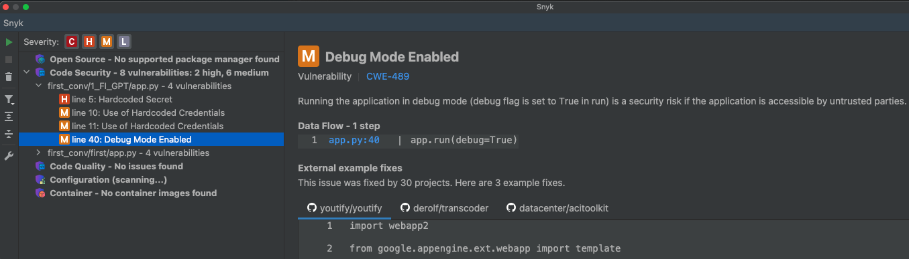

# 1_FI_GPT #
## Libraries: ##
```
pip install flask flask_jwt_extended
```

## Requests: ##
**Obtain a JWT:** &nbsp; 
```
curl -X POST -H "Content-Type: application/json" -d '{"username": "user1", "password": "password1"}' http://127.0.0.1:5000/login
```

**Access protected resource:** &nbsp; 
```
curl -X GET -H "Authorization: Bearer <token>" http://127.0.0.1:5000/protected
```

## Execution: ##


## Tips: ##
- In-code-comment (line 5): "Change this to a random, secure key in production"

## Notes: ##
- All libraries that needed to be installed were given. 
- The execution worked correctly. 
- :) Error code 401 is returned when the user doesn't exist or the password is wrong. Regarding security, this is a good response for this scenario.

# Vulnerability scanners: #
## PT AI: ##
1 of high severity:






2 potential:
1.





2.



## Snyk: ##
1 high severity:


3 medium severity:
1.


2.


3.


