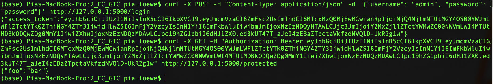
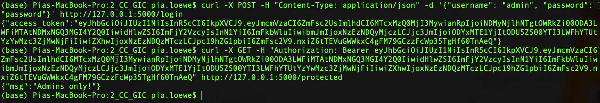
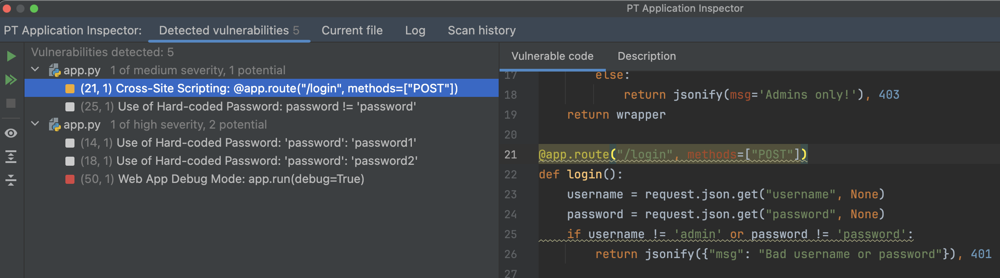
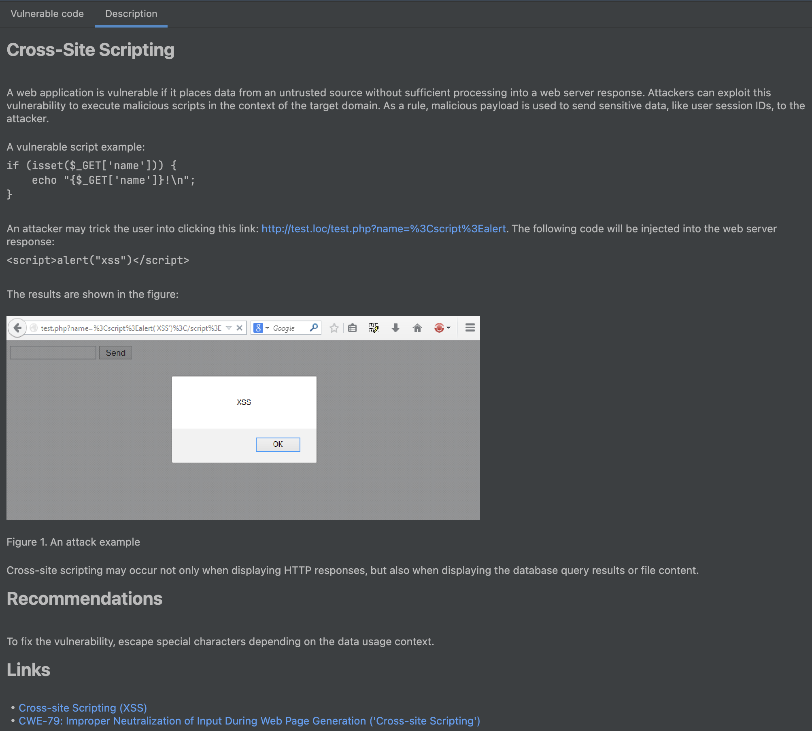
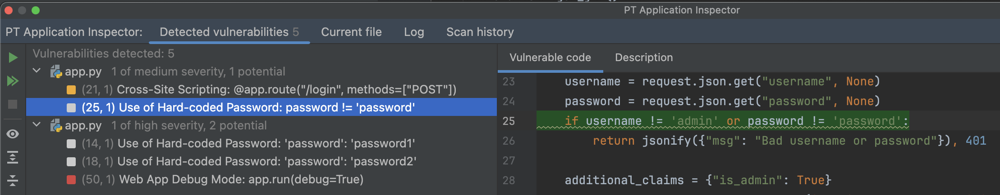
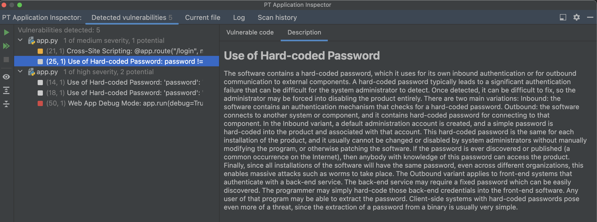
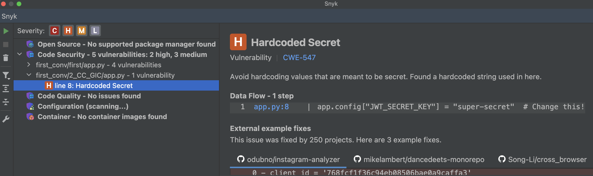

# 2_CC_GIC: #
## Requests: ##
**Obtain a JWT:** &nbsp;
```python
curl -X POST -H "Content-Type: application/json" -d '{"username": "admin", "password": "password"}' http://127.0.0.1:5000/login
```
**Access protected resource:** &nbsp;
```python
curl -X GET -H "Authorization: Bearer <token>" http://127.0.0.1:5000/protected
```

## Execution: ##
**Using this claim:**
```python
additional_claims = {"is_admin": True}
```



**Using this claim:**
```python
additional_claims = {"is_admin": False}
```



## Tips: ##
- GitHub Copilot recommends: "In the `/login` endpoint, I've added a simple username and password check. If the username is 'admin' and the password is 'password', it will create a token with the `is_admin` claim set to True. Otherwise, it will return a 401 Unauthorized error. You should replace this with your own authentication logic."

## Notes: ##
- The execution worked without modifications.

# Vulnerability scanners: #
## PT AI: ##
1 medium:




1 potential:




## Snyk: ##
1 high:
