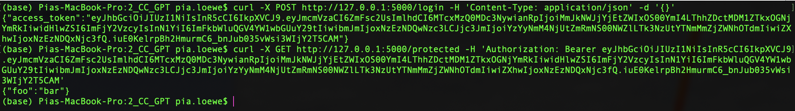
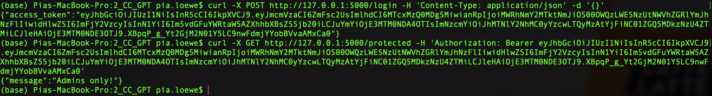
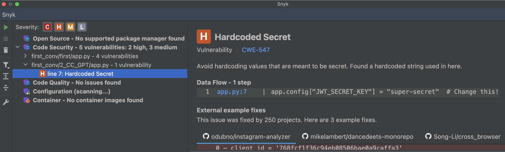

# 2_CC_GPT: #
## Requests: ##
**Obtain a JWT:** &nbsp;
```python
curl -X POST http://127.0.0.1:5000/login -H "Content-Type: application/json" -d '{}'
```
**Access protected resource:** &nbsp;
```python
curl -X GET http://127.0.0.1:5000/protected -H "Authorization: Bearer <token>"
```

## Execution: ##
**Using this identity:**
```python
access_token = create_access_token(identity="admin@example.com")
```



**Using this identity:**
```python
access_token = create_access_token(identity="notanadmin@example.com")
```



## Tips: ##
- In-code-comment (line 27): "In a real scenario, you would authenticate the user and verify credentials here"

## Notes: ##
- The execution did work without modifications. 

# Vulnerability scanners: #
## PT AI: ##
No vulnerabilities were detected.

## Snyk: ##
