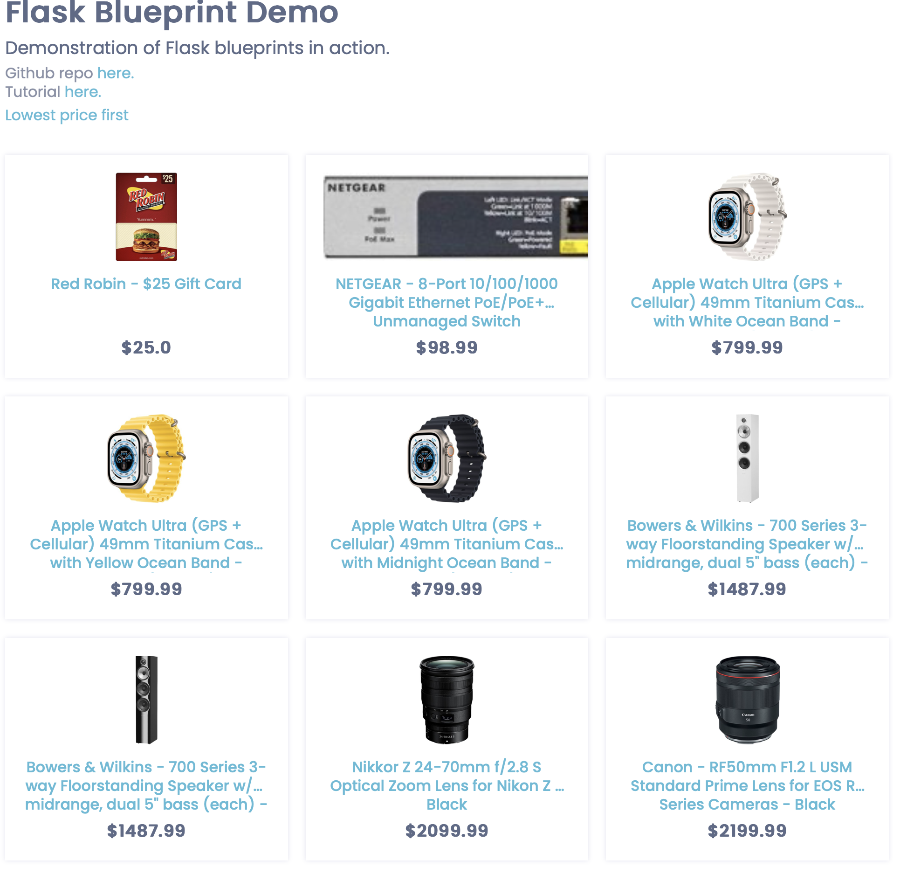

# 2_EC_GIC: #
Source: https://github.com/hackersandslackers/flask-blueprint-tutorial/tree/master

Before prompting GitHub Copilot, the faulty `Lowest price first` functionality was added to the code from the GitHub repo.

## Execution: ##
### After prompting GitHub Copilot: ###

## Notes: ##
- The execution worked functionally correct after GitHub Copilot's error fix.
- The solution by GitHub Copilot is similar to the one from `2_EC_GPT`, but seems more efficient.

# Vulnerability scanners: #
## PT AI: ##
No vulnerabilities were detected in the code generated by GitHub Copilot.

## Snyk: ##
No vulnerabilities were detected in the code generated by GitHub Copilot.