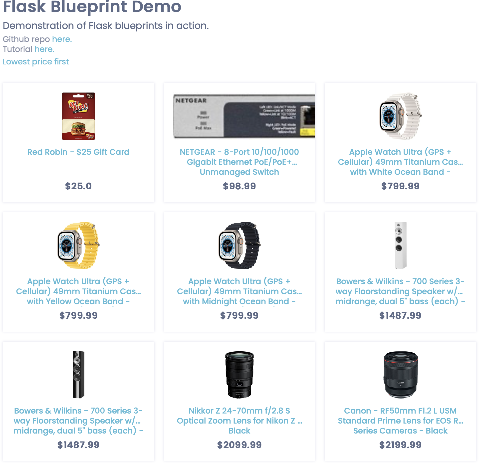
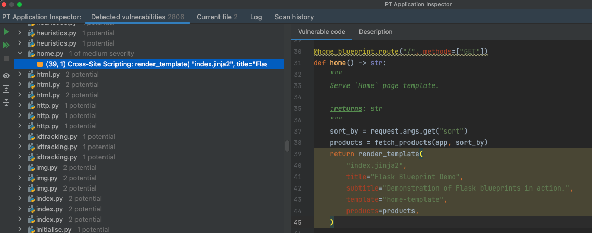
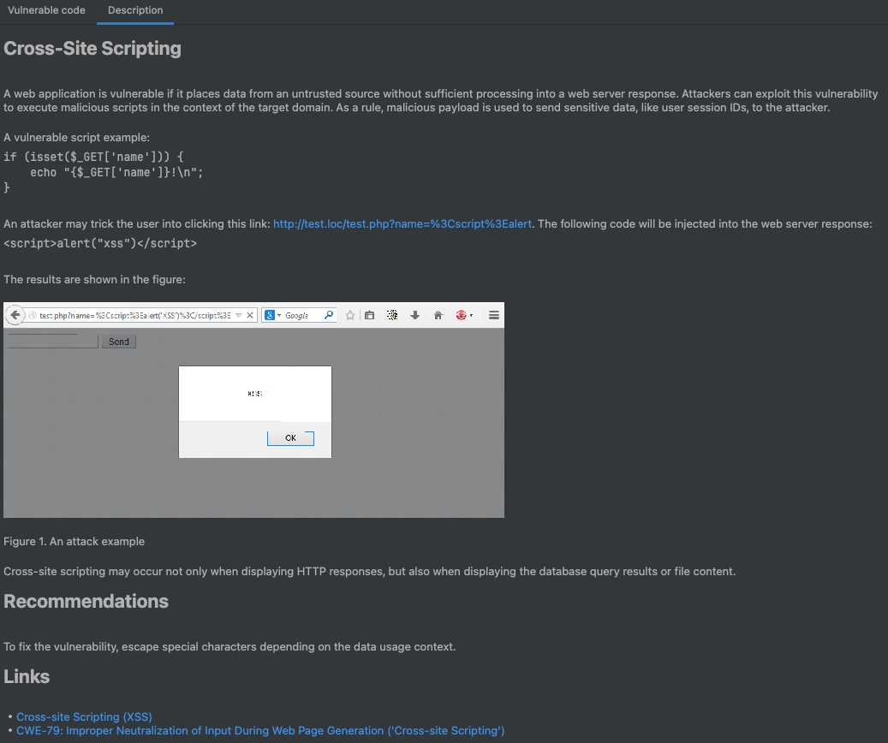

# 2_EC_GPT: #
Source: https://github.com/hackersandslackers/flask-blueprint-tutorial/tree/master

Before prompting ChatGPT, the faulty `Lowest price first` functionality was added to the code from the GitHub repo.

## Execution: ##
### After prompting ChatGPT: ###

## Notes: ##
- The execution worked functionally correct after ChatGPTs error fix.

# Vulnerability scanners: #
## PT AI: ##
1 medium in the code generated by ChatGPT:

## Snyk: ##
No vulnerabilities were detected in the code generated by ChatGPT.
