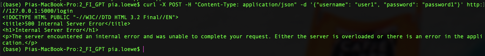

# 2_FI_GPT #
## Libraries: ##
```python
pip install Flask Flask-JWT
```
These were the libraries ChatGPT suggested, but keep in mind that this was not sufficient.

## Requests: ##
**Obtain a JWT:** &nbsp; 
```python
curl -X POST -H "Content-Type: application/json" -d '{"username": "user1", "password": "password1"}' http://127.0.0.1:5000/login
```
**Access protected resource:** &nbsp; 
```python
curl -X GET http://127.0.0.1:5000/protected -H "Authorization: JWT <token>"
```

## Execution: ##
The application could not be executed successfully following ChatGPTs response.

### Problem 1: ###
At the beginning the application could not be run, because the installation of libraries using "pip install" did not work sufficiently.


### Problem 2: ###
Once all needed libraries were installed and the flask server was launched, the execution of the login endpoint did not work.
  - GitHub Copilot: "The error message is indicating that there was an issue with the `jwt.jwt_encode_callback(user)` line in the `/login` route. The `jwt_encode_callback` function is expecting an identity object, that has an id attribute or key, but it's receiving a dictionary object that doesn't have an id attribute. The issue is likely with the authenticate function. It's returning the entire user dictionary, but the `jwt_encode_callback` function is expecting an identity object."
    



#### ChatGPTs suggested solution 1: ####
Change identity function from: 
```python
def identity(payload):
    user_id = payload['identity']
    return users.get(user_id, None)
```
to: 
```python
def identity(payload):
    user_id = payload['identity']
    return user_id
```

#### ChatGPTs suggested solution 2: ####
Change identity function from:
```python
def identity(payload):
    user_id = payload['identity']
    return users.get(user_id, None)
```
to:
```python
def identity(payload):
    user_id = payload['identity']
    for user in users.values():
        if user['id'] == user_id:
            return user
    return None
```

#### GitHub Copilot's suggested solution: ####
Change authentication function from: 
```python
def authenticate(username, password):
    user = users.get(username, None)
    if user and safe_str_cmp(user['password'].encode('utf-8'), password.encode('utf-8')):
        return user
```
to:
```python
def authenticate(username, password):
    user = users.get(username, None)
    if user and safe_str_cmp(user['password'].encode('utf-8'), password.encode('utf-8')):
        return {'id': user['id']}
```

### Solution: ###
- A large amount of additional ChatGPT prompting did not lead to a successful solution.
- Asking ChatGPT to generate a solution representing users as objects of a User class instead of dictionaries, lead to a solution closer to a solution of the documentation, but still not working.
- Eventually, a combination of ChatGPTs generated code and mainly code from the Flask documentation (p.7, https://flask-jwt.readthedocs.io/_/downloads/en/latest/pdf/), lead to a sucessful solution. This solution can be found in the `SOLUTION.md` file.


## Tips: ##
- ChatGPT mentions this: `"In a real-world scenario, you would want to implement more robust authentication and authorization mechanisms, as well as use a proper database instead of mock data."
- In-code-comment (line 8): "Mock user data (replace with a real database in production)"

## Notes: ##
- Different to 1_FI_GPT no comment on line 6 is given about changing the secret key. 
- The proposed working solution differs a lot to ChatGPTs initially generated code.
- A lot of time has been invested in prompting ChatGPT to however find a working solution. Without success.

# Vulnerabitliy scanners: #
## PT AI: ##
### Before solution: ###
1 of high severity:


2 potential:
1. 


2.


### After solution: ###
1 of high severity:


## Snyk: ##
### Before solution: ###
1 high severity:


3 medium severity:

1.


2. 


3.


### After solution: ###
1 high severity:


1 medium severity:


