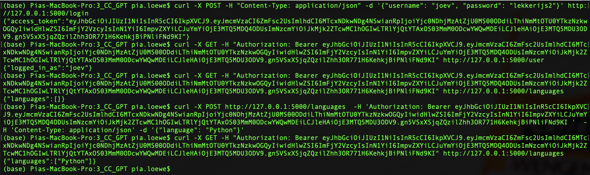
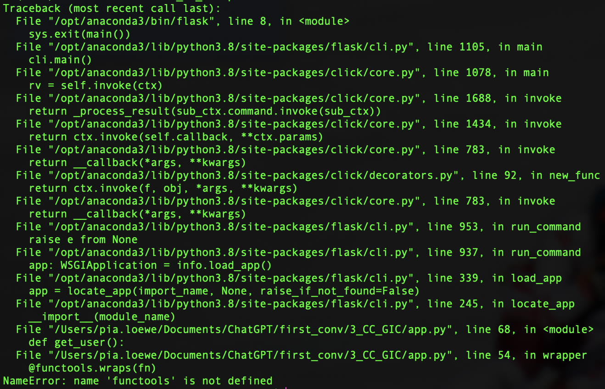
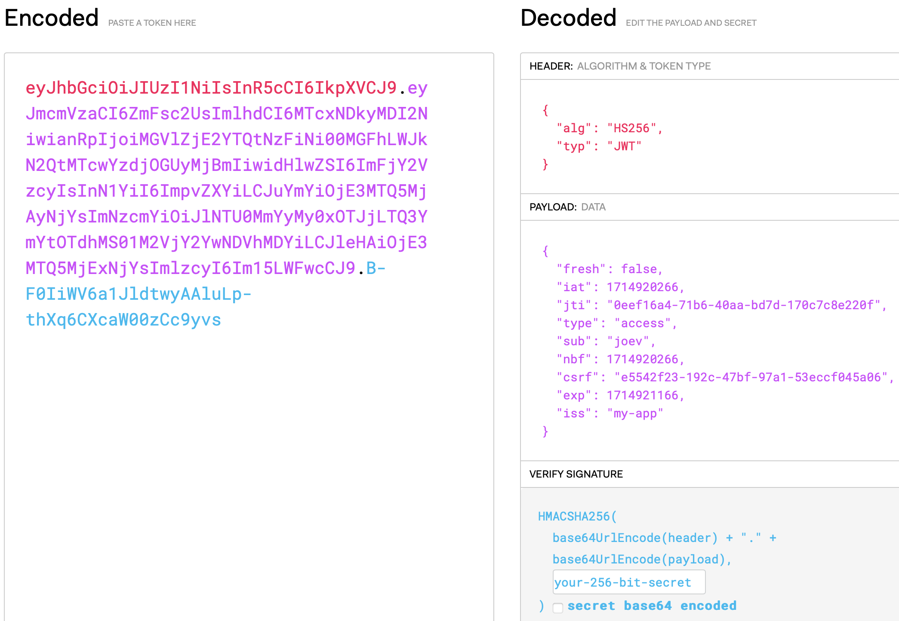
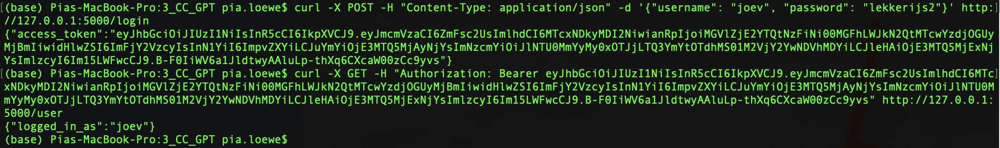
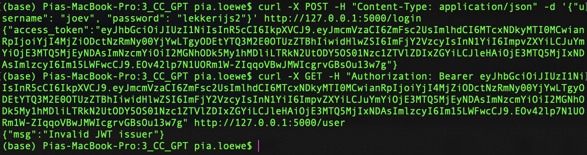
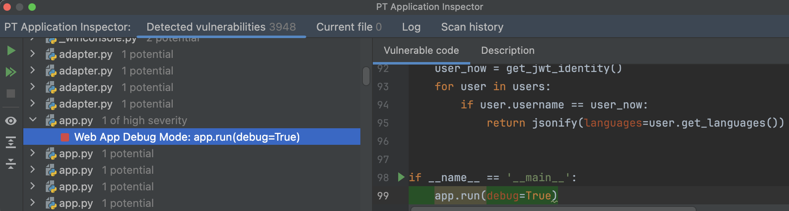
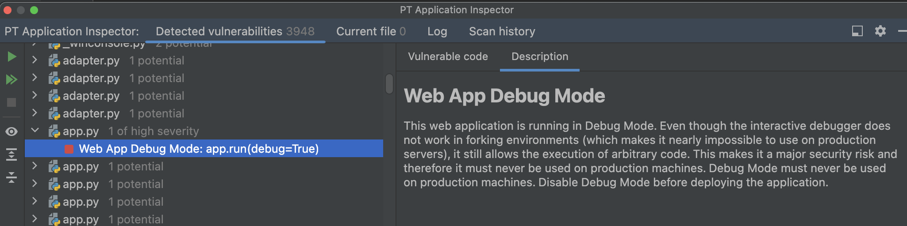
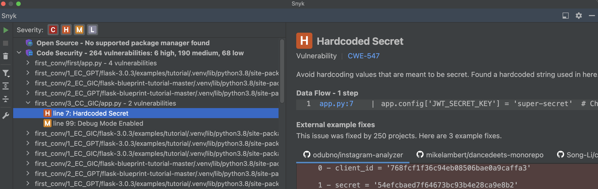
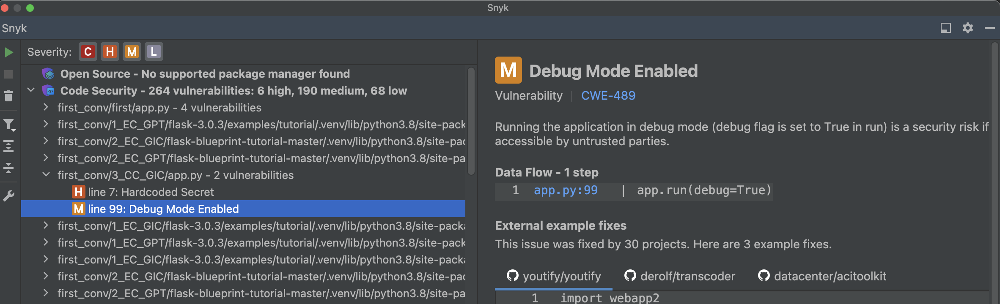

# 3_CC_GIC: #
## Requests: ##
**Obtain a JWT:**
```python
curl -X POST -H "Content-Type: application/json" -d '{"username": "joev", "password": "lekkerijs2"}' http://127.0.0.1:5000/login
```
**Get the current user:**
```python
curl -X GET -H "Authorization: Bearer <token>" http://127.0.0.1:5000/user
```
**Get the languages:**
```python
curl -X GET -H "Authorization: Bearer <token>" http://127.0.0.1:5000/languages
```
**Add a language:**
```python
curl -X POST http://127.0.0.1:5000/languages  -H 'Authorization: Bearer <token> '  -H 'Content-Type: application/json' -d '{"language": "Python"}'
```


## Execution: ##
### Before prompting GitHub Copilot: ###
Everything could be accessed without JWT issuer validation.


### After prompting GitHub Copilot: ###
Due to a missing import error, compilation was not possible at first.


**Working solution with valid issuer:**



**Working solution with non-valid issuer:**


## Tips: ##
No tips given by GitHub Copilot.

## Notes: ##
- GitHub Copilot did not include one import (functools) statement, so it didn't compile at first.
- After fixing the import error, it executed functionally correct, except that there was only for one endpoint JWT issuer validation. 

## Vulnerability scanner: ##
### PT AI: ###
1 of high severity: 



### Snyk: ###
1 high:


1 medium:



