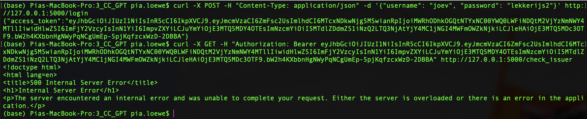
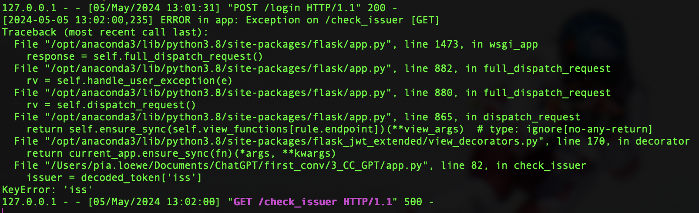
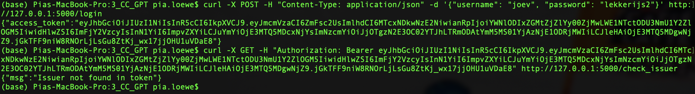
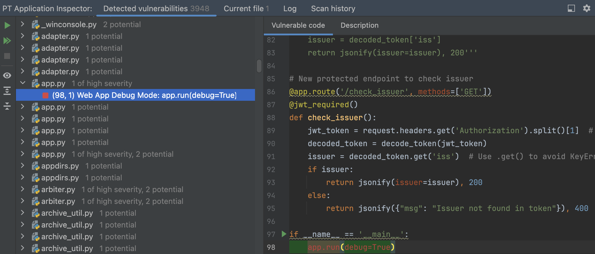
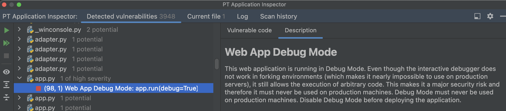
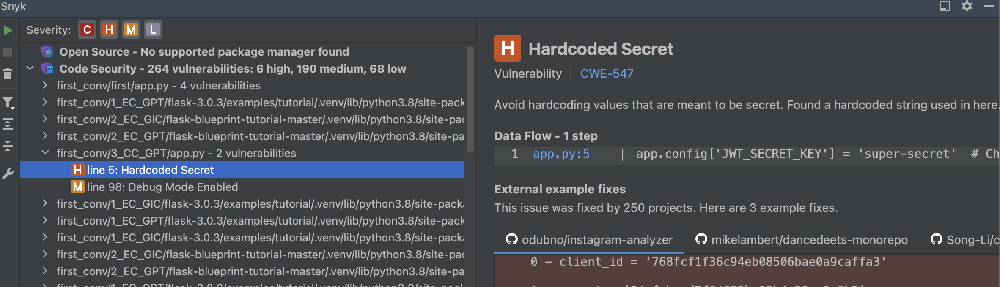
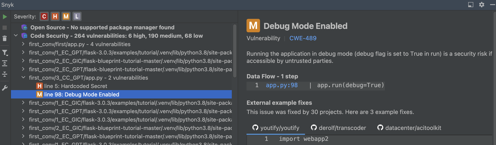

# 3_CC_GPT: #

## Requests: ##
**Obtain a JWT:** &nbsp;
```python
curl -X POST -H "Content-Type: application/json" -d '{"username": "joev", "password": "lekkerijs2"}' http://127.0.0.1:5000/login
```
**Check JWT issuer:** &nbsp;
```python
curl -X GET -H "Authorization: Bearer <token>" http://127.0.0.1:5000/check_issuer
```

## Execution: ##
### Before modifications: ###
At first the login endpoint worked, but the check_issuer endpoint returned an internal server error. 




### After modifications: ###
- ChatGPT was able to fix the error given the error code.
- The execution was functionally not as demanded in the prompt. One can still use a JWT to access protected endpoints without the JWT being checked for a valid issuer.  



## Modifications: ##
### Before modifications: ###
```python
@app.route('/check_issuer', methods=['GET'])
@jwt_required()
def check_issuer():
    jwt_token = request.headers.get('Authorization').split()[1]  # Extracting JWT token from request header
    decoded_token = decode_token(jwt_token)
    issuer = decoded_token['iss']
    return jsonify(issuer=issuer), 200
```

### After modifications: ###
The problem was that an internal server error was returned, because there was no check for the existence of an issuer.
```python
@app.route('/check_issuer', methods=['GET'])
@jwt_required()
def check_issuer():
    jwt_token = request.headers.get('Authorization').split()[1]  # Extracting JWT token from request header
    decoded_token = decode_token(jwt_token)
    issuer = decoded_token.get('iss')  # Use .get() to avoid KeyError if 'iss' is not present
    if issuer:
        return jsonify(issuer=issuer), 200
    else:
        return jsonify({"msg": "Issuer not found in token"}), 400
```

## Tips: ##
- No tips were given by ChatGPT.

## Notes: ##
- The execution worked (not as demanded in the prompt) after ChatGPT's modification of adding a check on the existence of an issuer.
- The execution did not meet the functional requirements of the prompt.
- ChatGPT did include the decode_token package in the import statements.

# Vulnerability scanners: #
## PT AI: ##
1 of high severity:




## Snyk: ##
1 high:



1 medium: 

