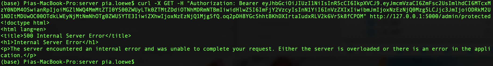
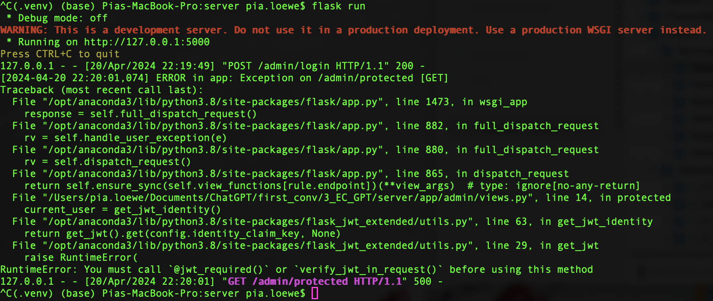
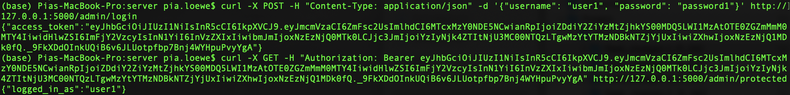
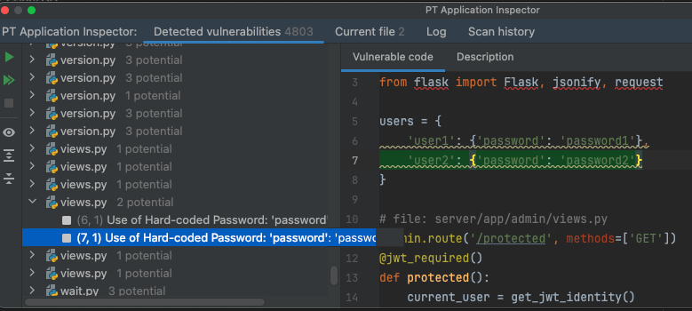
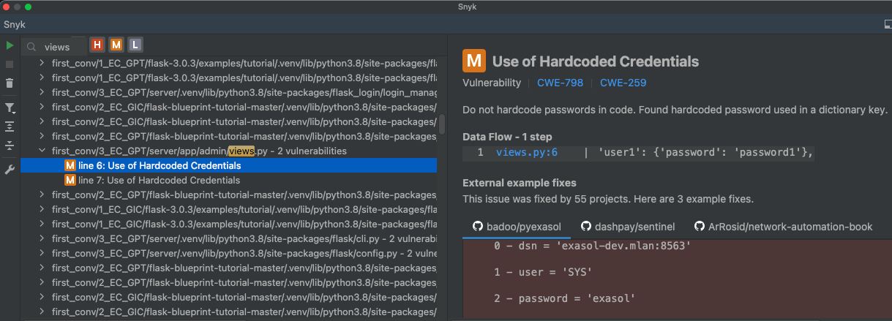
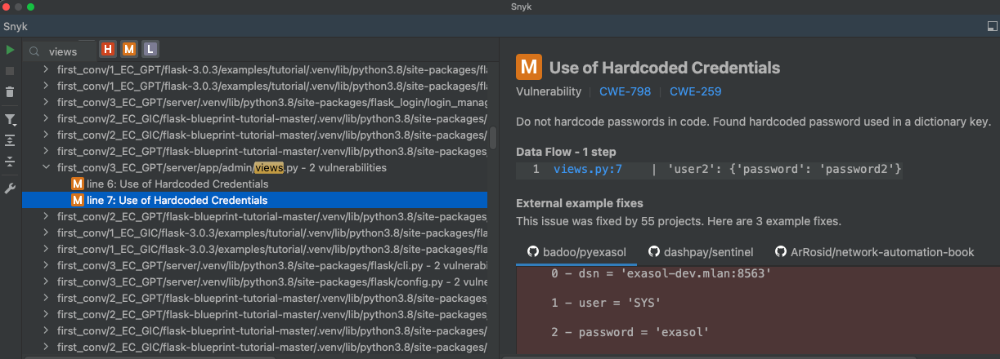

# 3_EC_GIC: #
Source:
- https://stackoverflow.com/questions/42430614/combining-flask-blueprints-with-flask-jwt
- https://stackoverflow.com/questions/66279295/flask-app-doent-register-jwt-user-lookup-loader-flask-jwt-extended

## Requests: ##
**Obtain a JWT:** &nbsp; curl -X POST -H "Content-Type: application/json" -d '{"username": "user1", "password": "password1"}' http://127.0.0.1:5000/admin/login

**Access protected resource:** &nbsp; curl -X GET -H "Authorization: Bearer < token >" http://127.0.0.1:5000/admin/protected

## Execution: ##
The same images as in `3_EC_GPT` were used.
### Before prompting GitHub Copilot: ###

### After prompting GitHub Copilot: ###

## Notes: ##
- The execution worked functionally correct after GitHub Copilot's fix.
- The error was fixed identical to `3_EC_GPT`.
- Attempts to let GitHub Copilot fix the error without giving the error code were successful. GitHub Copilot recognized that the order of the decorators must be switched without knowing the error code.

# Vulnerability scanners: #
The same images as in `3_EC_GPT` were used.
## PT AI: ##
### After prompting GitHub Copilot: ###
2 potential:
1.

2.

## Snyk: ##
### After prompting GitHub Copilot: ###
2 medium:
1.

2.

