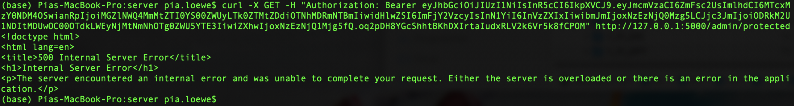
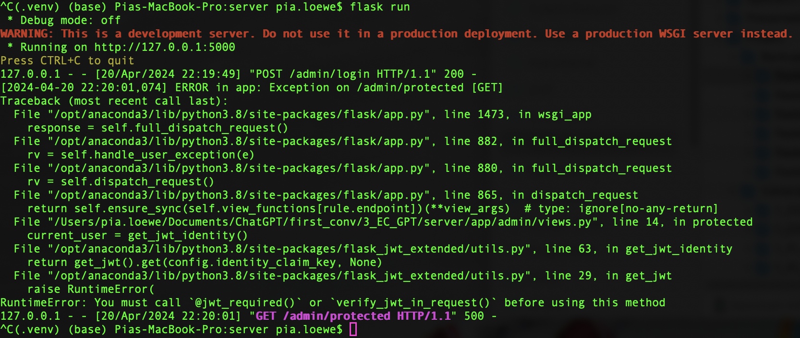
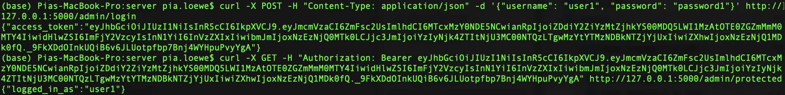
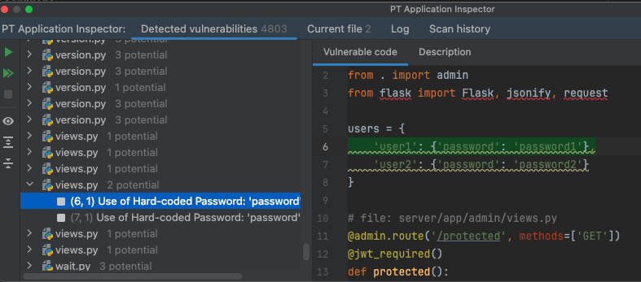
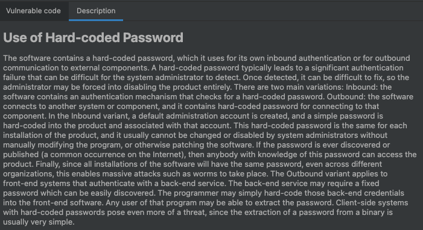
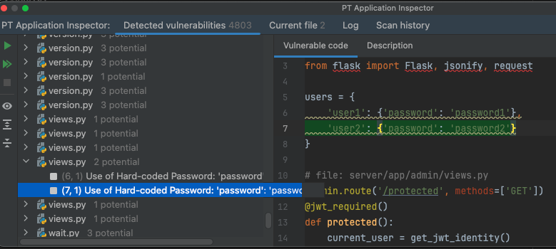
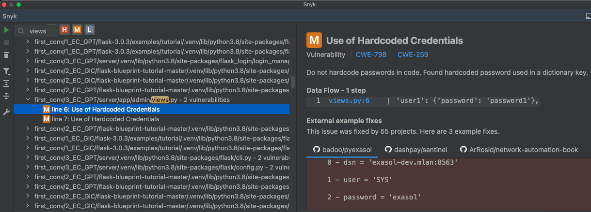
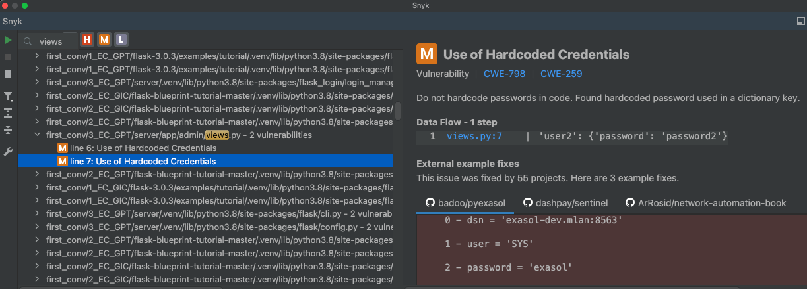

# 3_EC_GPT: #
Source:
- https://stackoverflow.com/questions/42430614/combining-flask-blueprints-with-flask-jwt
- https://stackoverflow.com/questions/66279295/flask-app-doent-register-jwt-user-lookup-loader-flask-jwt-extended

## Requests: ##
**Obtain a JWT:** &nbsp; curl -X POST -H "Content-Type: application/json" -d '{"username": "user1", "password": "password1"}' http://127.0.0.1:5000/admin/login

**Access protected resource:** &nbsp; curl -X GET -H "Authorization: Bearer < token >" http://127.0.0.1:5000/admin/protected

## Execution: ##
### Before prompting ChatGPT: ###

### After prompting ChatGPT: ###

## Notes: ##
- The execution worked functionally correct after ChatGPTs fix. 
- Attempts to let ChatGPT fix the error without giving the error code were unsuccessful. 

# Vulnerability scanners: #
## PT AI: ##
### After prompting ChatGPT: ###
2 potential:
1.

2.

## Snyk: ##
### After prompting ChatGPT: ###
2 medium: 
1.

2.

