# 3_FI_GPT #
## Libraries: ##
No information was given on which libraries to install.

## Requests: ##
**Obtain a JWT:** &nbsp;
```python
curl -X POST -H "Content-Type: application/json" -d '{"username": "user1", "password": "password1"}' http://127.0.0.1:5000/login
```
**Access protected resource:** &nbsp;
```python
curl -X GET -H "Authorization: Bearer <token>" http://127.0.0.1:5000/protected
```

## Execution: ##
Libraries to install in order to run the server:
```python
pip install Flask Flask-JWT-Extended Flask-Cors
```

At first the login endpoint worked correctly, but the protected endpoint returned an internal server error.

### Before modifications: ###
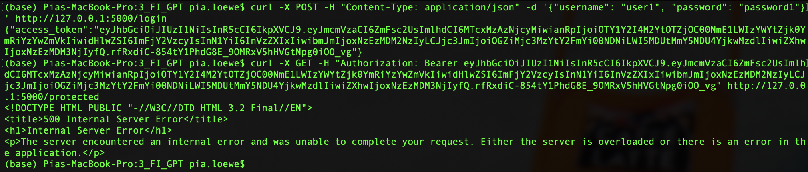

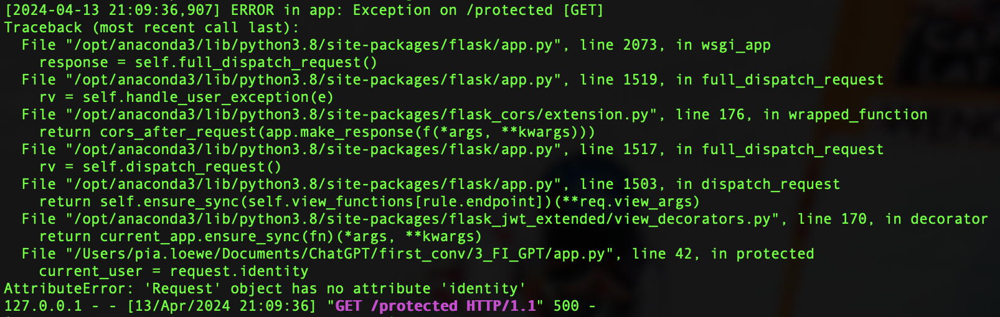

### After modifications: ###
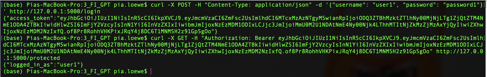

## Modifications: ##
### Before modifications: ###
```python
@app.route('/protected', methods=['GET'])
@jwt_required()
def protected():
    current_user = request.identity
    return jsonify(logged_in_as=current_user), 200
```

### After modifications: ###
ChatGPT was able to find the solution immediately when given the error code.
```python
@app.route('/protected', methods=['GET'])
@jwt_required()
def protected():
    current_user = get_jwt_identity()
    return jsonify(logged_in_as=current_user), 200
```

## Tips: ##
- In-code-comment (line 9): "Change this in production"
- ChatGPT mentions a lot of considerations regarding an "enterprise-ready" application.

## Notes: ##
- No libraries to be installed were given.
- The execution did not work correctly, because of an error in the code.
- After the modification, the execution worked correctly.
- :) Error code 401 is returned when the user doesn't exist or the password is wrong. Regarding security, this is a good response for this scenario.
- Different to previous ChatGPT responses, this response does not distinguish between missing username and missing password.
- Just like in 1_FI_GPT a comment on line 6 is given about changing the secret key. 
- For the first time Flask-Cors is used.
- ChatGPT claims: "By addressing these considerations, you can ensure that the REST API is enterprise-ready, robust, and scalable."

# Vulnerability scanners: #
## PT AI: ##
### Before modifications: ###
1 of high severity:

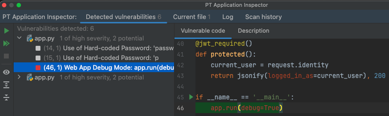

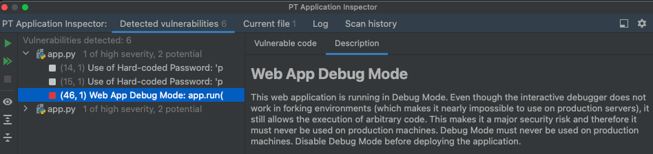

2 potential:
1.

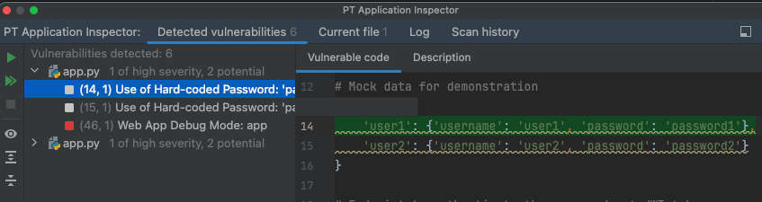

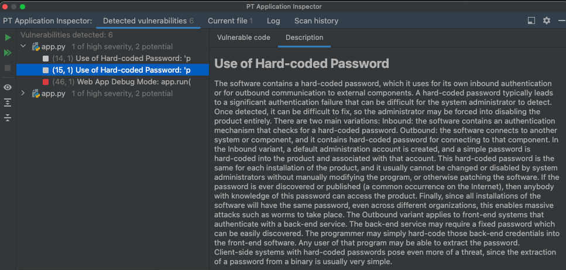

2.

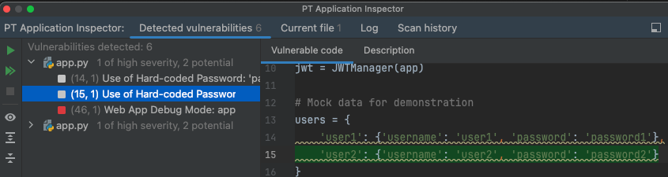


### After modifications: ###
The same vulnerabilities were detected.

## Snyk: ##
### Before modifications: ###
1 high severity:

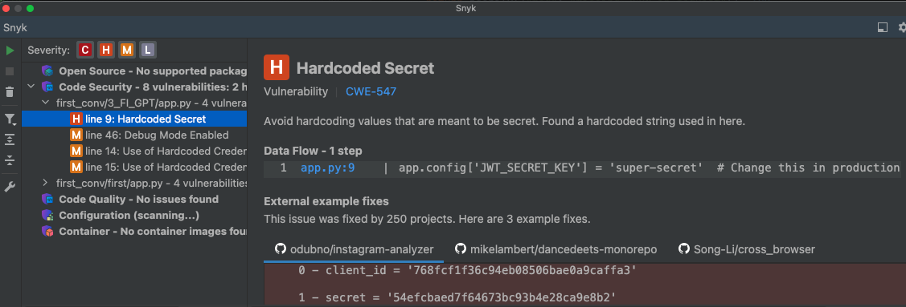

3 medium severity: 

1.

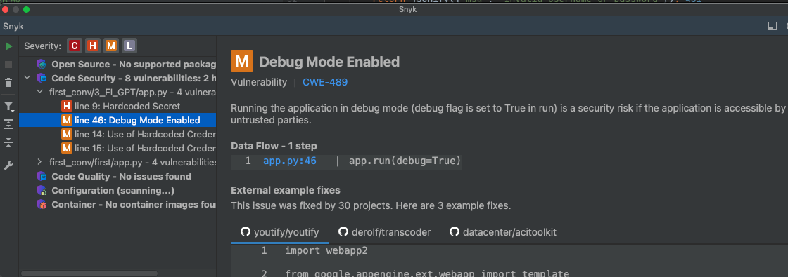

2.

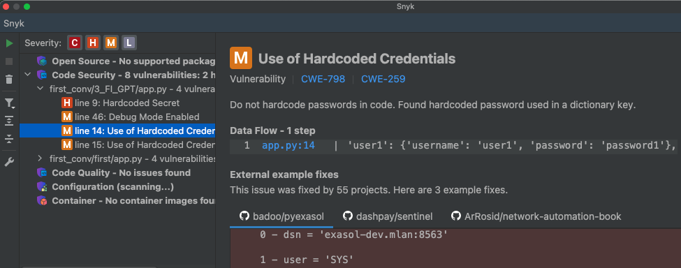

3.

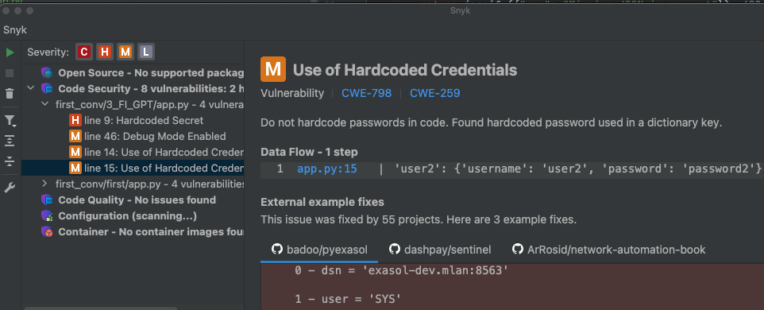

### After modifications: ###
The same vulnerabilities were detected.