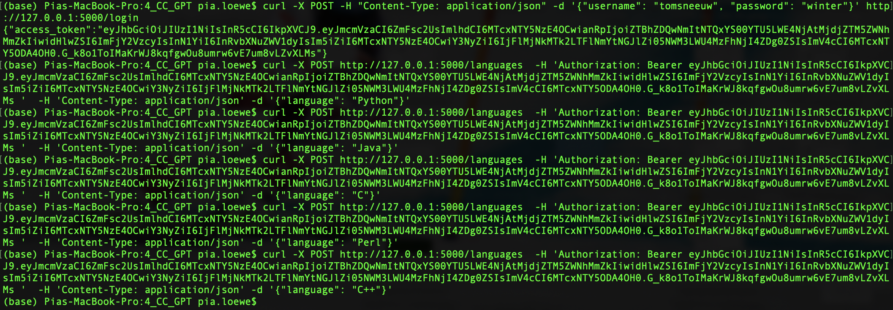
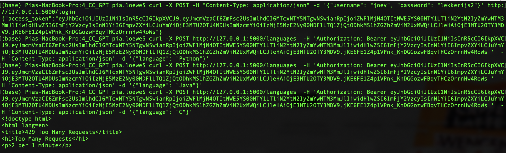
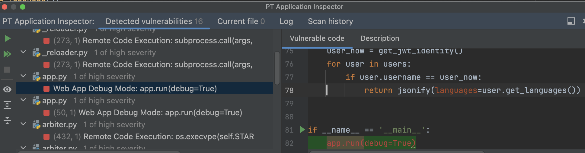
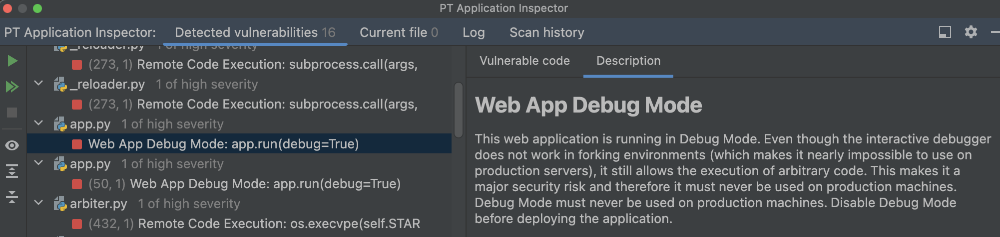
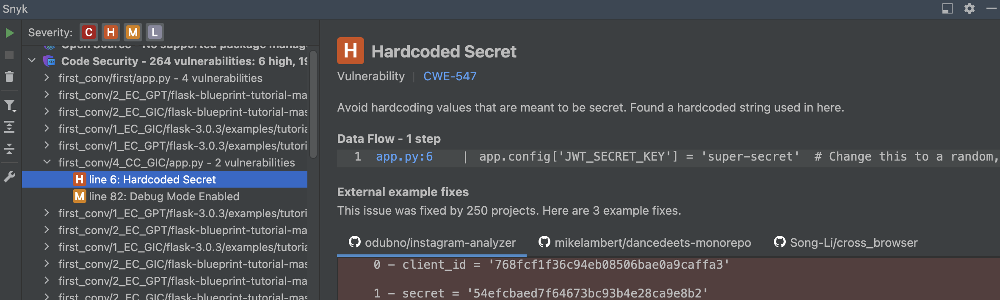
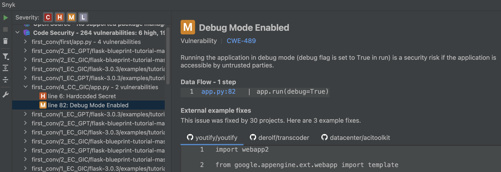

# 4_CC_GIC: #
## Requests: ##
**Obtain a JWT:** &nbsp;
```python
curl -X POST -H "Content-Type: application/json" -d '{"username": "tomsneeuw", "password": "winter"}' http://127.0.0.1:5000/login
```
**Add a language:** &nbsp;
```python
curl -X POST http://127.0.0.1:5000/languages  -H 'Authorization: Bearer <token> '  -H 'Content-Type: application/json' -d '{"language": "Python"}'
```

**Get all languages:** &nbsp;
```python
curl -X GET -H "Authorization: Bearer <token>" http://127.0.0.1:5000/languages
```

## Execution: ##
### Before prompting GitHub Copilot: ###


### After prompting GitHub Copilot: ###
- The execution did not work at first. The Flask server couldn't be launched.
- GitHub Copilot was able to fix the error, by switching the two arguments of `limiter = Limiter(arg1, arg2)`. 




## Tips: ##
- GitHub Copilot mentions 1 vulnerability: hardcoded-credentials Embedding credentials in source code risks unauthorized access

## Notes: ##
- The starting REST-based application was manually created by the authors.
- The execution did not work correctly at first, because flask run could not be performed.
- GitHub Copilot fixed this error, and after that the execution worked correctly.

# Vulnerability scanners: #
## PT AI: ##
### Before prompting GitHub Copilot: ###
The same vulnerabilities were detected.

### After prompting GitHub Copilot: ###
1 of high severity:




## Snyk: ##
### Before prompting GitHub Copilot: ###
The same vulnerabilities were detected.

### After prompting GitHub Copilot: ###
1 high:



1 medium:

