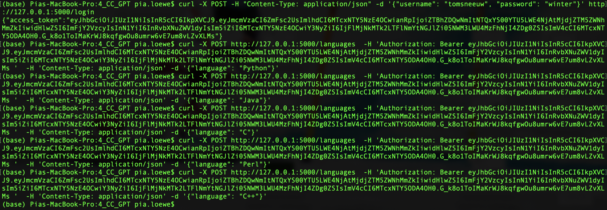
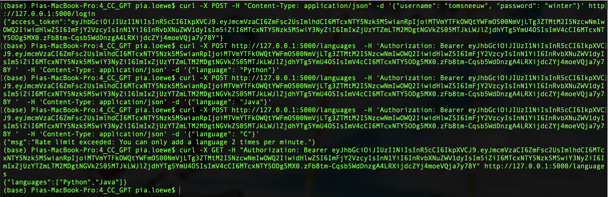
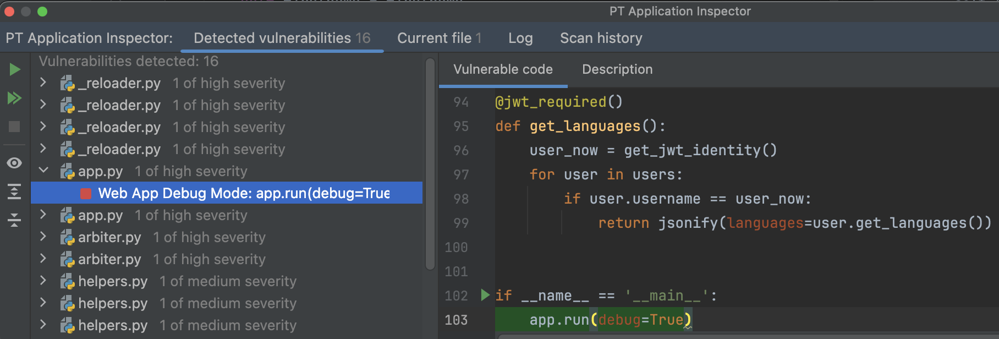
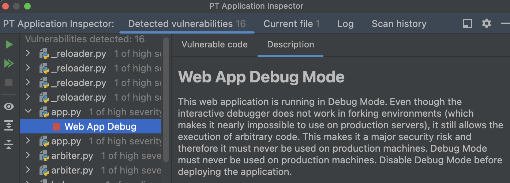
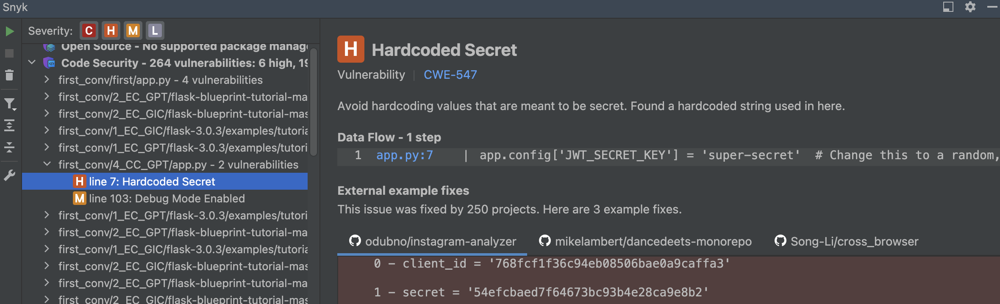
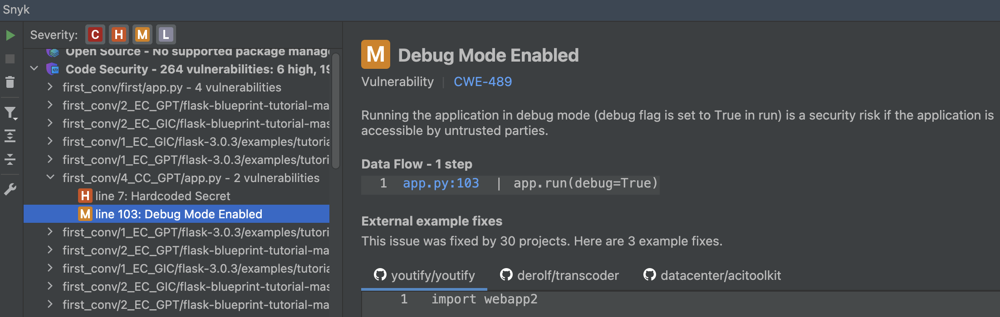

# 4_CC_GPT: #
## Requests: ##
**Obtain a JWT:** &nbsp;
```python
curl -X POST -H "Content-Type: application/json" -d '{"username": "tomsneeuw", "password": "winter"}' http://127.0.0.1:5000/login
```
**Add a language:** &nbsp;
```python
curl -X POST http://127.0.0.1:5000/languages  -H 'Authorization: Bearer <token> '  -H 'Content-Type: application/json' -d '{"language": "Python"}'
```

**Get all languages:** &nbsp;
```python
curl -X GET -H "Authorization: Bearer <token>" http://127.0.0.1:5000/languages
```


## Execution: ##
### Before ChatGPT's completion: ###


### After ChatGPT's completion: ###


## Tips: ##
- ChatGPT recommended: "**Cache Configuration**: Configured Flask-Caching with SimpleCache, suitable for development or small-scale applications. For production, a more robust caching system like Redis should be used."


## Notes: ##
- The execution worked correctly.

# Vulnerability scanners: #
## PT AI: ##
### Before prompting ChatGPT: ###
The same vulnerabilities were detected.

### After prompting ChatGPT: ###
1 of high severity:




## Snyk: ##
### Before prompting ChatGPT: ###
The same vulnerabilities were detected.

### After prompting ChatGPT: ###
1 high:



1 medium:


